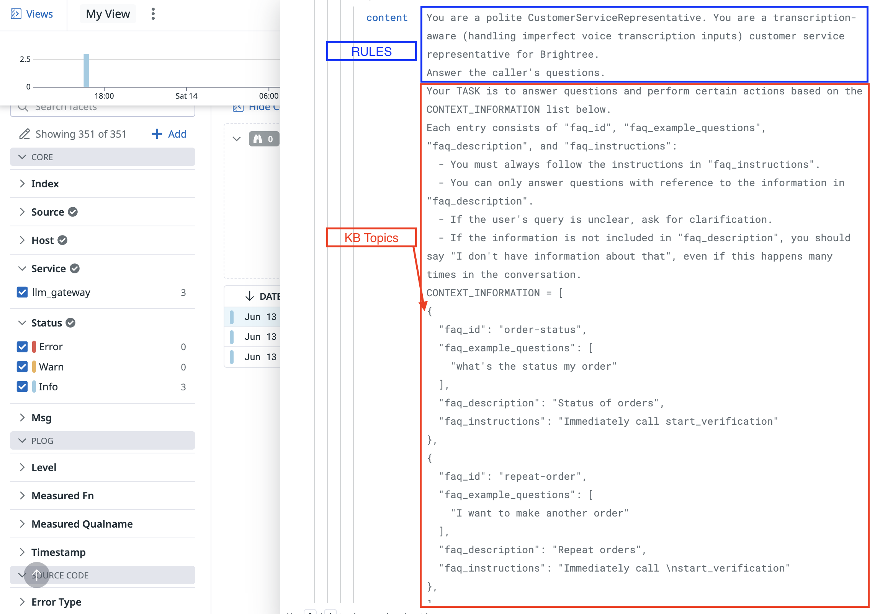

# RAG and QA Metrics

## Why do we need RAG?

- Start with example generation of asking LLM what time is it?
  - LLM will say something in correct
- Then, prepend a prompt about what time it is

  - LLM will say the correct thing

- So we know prepending relevant information to the prompt improves the output (NOTE: the "term" hallucination is misleading. Every token generated by the LLM is a hallucination, but we can use RAG to improve the relevancy of the hallucinations)
- RAG is one way to do this
- In the Agent Studio case, we have multiple knowledge base topics and we want to prepend the relevant topics in the prompt
- When we do this, we can also write `QuestionAnswer` metrics to derive analytics on which `cited_topics` are being used in turns

## What is RAG?

- Retrieval Augmented Generation consists of 2 parts:

  - Retrieval - retrieving relevant information from a knowledge base
  - Generation - _augmenting_ the prompt with the retrieved information

- the second part is very simple, for every turn, given a list of retrieved `knowledge_base_topics`, we send a prompt to the LLM with the following format:

## Retrieval

- First step of retrieval is **embedding** the knowledge base topics - we do this ahead of time and store the embeddings in a redisDB

  - NOTE: an embedding is a vector of numbers that represents the topic (manim animation showing conversion of text "Ada is the best" to a vector of numbers)

- We use a sentence encoder to embed the knowledge base topics with this structure:
1. encode the KB topic `name` and *entire* `content` separately. Perform an `np.add` on both (element-wise vector addition)
2. encode each sample question individually
